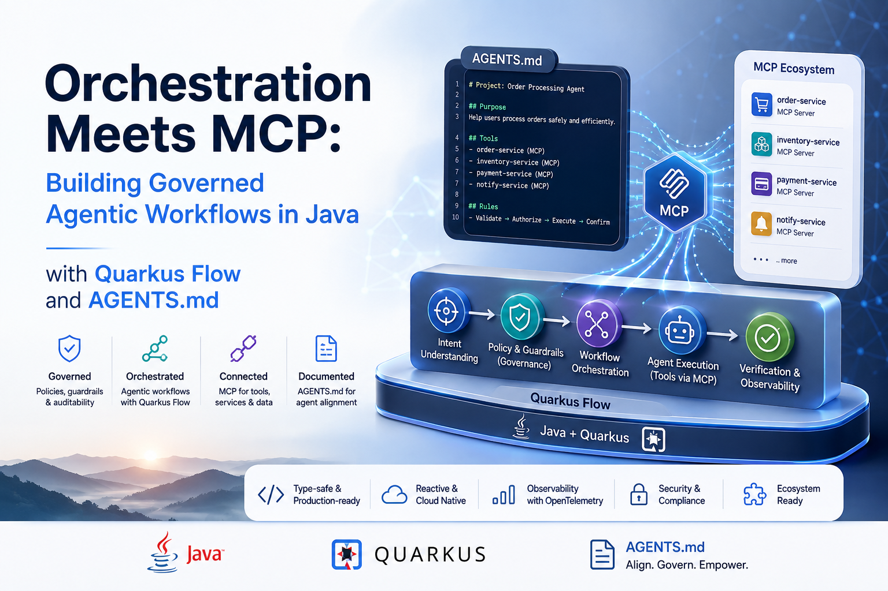
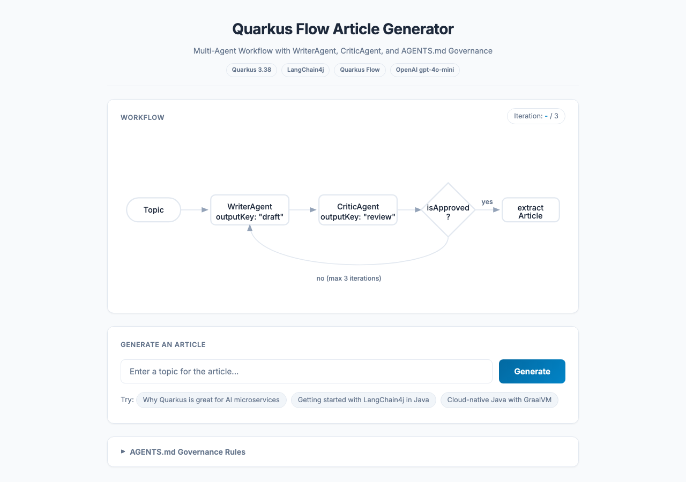

# Governed Agentic Workflows with Quarkus Flow, LangChain4j, and AGENTS.md

This demo shows how to build a governed, multi-agent article publishing workflow in Java using [Quarkus Flow](https://docs.quarkiverse.io/quarkus-flow/dev/) and [LangChain4j](https://docs.quarkiverse.io/quarkus-langchain4j/dev/index.html).

A **WriterAgent** drafts a technical blog post, a **CriticAgent** reviews it for accuracy and clarity, and a `@LoopAgent` orchestrates the write-review-revise cycle (up to 3 iterations) until the critic approves. Governance rules are defined in [`AGENTS.md`](src/main/resources/AGENTS.md).

## Prerequisites

- Java 25+
- An [OpenAI API key](https://platform.openai.com/api-keys)

## Running the demo

1. Export your OpenAI API key:

```shell
export OPENAI_API_KEY=<your-key>
```

2. Start Quarkus in dev mode:

```shell
./mvnw quarkus:dev
```

3. Open the Web UI at http://localhost:8080/ to generate articles interactively:



4. Or use the REST API directly:

```shell
curl -s -X POST http://localhost:8080/api/articles/generate \
  -H "Content-Type: application/json" \
  -d '{"topic": "Why Quarkus is great for AI-powered microservices"}' | jq .
```

The response contains the approved article after the write-review loop completes:

```json
{
  "article": "..."
}
```

5. Explore the Quarkus Flow Dev UI at http://localhost:8080/q/dev/ to inspect the generated workflow definition and execution traces.

## Running tests

```shell
./mvnw test
```

Tests use `@InjectMock` to mock the AI agents, so no API key is required.

## Project structure

```
src/main/java/org/acme/
  agent/ContentAgents.java    # WriterAgent, CriticAgent, and ArticlePublisher (@LoopAgent)
  api/ArticleResource.java    # REST endpoint: POST /api/articles/generate
src/main/resources/
  AGENTS.md                   # Governance rules for agent behavior
  application.properties      # OpenAI and LangChain4j configuration
```

## How it works

| Component | Role |
|---|---|
| `WriterAgent` | Drafts or revises a blog post (`@Agent`, `outputKey = "draft"`) |
| `CriticAgent` | Reviews the draft for technical accuracy and clarity (`@Agent`, `outputKey = "review"`) |
| `ArticlePublisher` | Orchestrates the write-review loop with `@LoopAgent(maxIterations = 3)` and `@ExitCondition` (exits when the review starts with "APPROVED") |
| `AGENTS.md` | Defines governance rules (accuracy, safety, output format) referenced by agent system messages |

At build time, Quarkus Flow compiles the `@LoopAgent` annotation into a [CNCF Serverless Workflow](https://serverlessworkflow.io/) definition. No separate workflow engine runs at runtime.

## Related guides

- [Quarkus Flow + LangChain4j](https://docs.quarkiverse.io/quarkus-flow/dev/langchain4j.html)
- [Quarkus LangChain4j](https://docs.quarkiverse.io/quarkus-langchain4j/dev/index.html)
- [LangChain4j MCP client](https://docs.quarkiverse.io/quarkus-langchain4j/dev/index.html)
